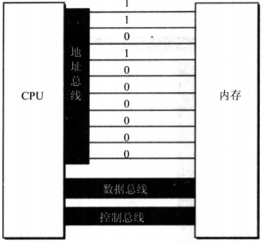

###  1.8地址总线

```
现在我们知道，CPU是通过地址总线来指定存储器单元的。

可见地址总线上能传送多少个不同的信息，CPU就可以对多少个存储单元进行寻址。

```


```
现假设，一个CPU有10根地址总线，让我们来看一下它的寻址情况。

我们知道，在电子计算机中，一根导线可以传送的稳定状态只有两种，高电平或者是低电平。


用二进制表示就是0或者1,10根导线可以传送10位二进制数据。

而10位二进制可以表示多少个不同的数据呢？2的10次方个。

>>> print 2**10
1024

最小数为0，最大数为1023。

```

```
下图1.4展示了一个具有10根地址线的CPU，向内存发出地址信息11时10根地址线上传送的二进制信息。

考虑一下，访问地址为12、13、14等的内存单元时，地址总线上传送的内容是什么？

```

```
一个CPU有N根地址线，则可以说这个CPU的地址总线宽度为N。

这样的CPU最多可以寻找2的N次方个内存单元。

```


